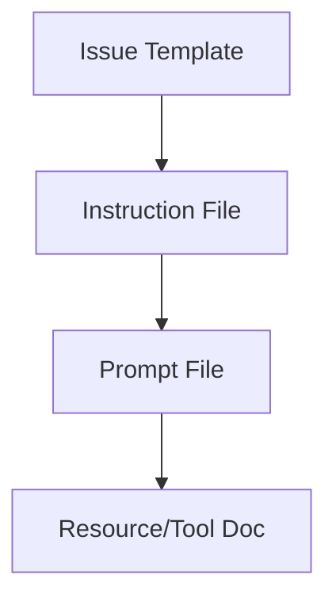

# GitHub Maintenance Prompt

This prompt provides guidance for maintaining the `.github/` infrastructure that enables agentic development.

## Overview

The `.github/` directory contains the infrastructure for agentic maintenance:
- Agents: Specialized AI assistants for different domains
- Instructions: High-level rules sent with every request
- Prompts: Detailed task-specific guidance
- Issue Templates: Entry points for agent workflows
- PR Templates: Standardized pull request descriptions
- Workflows: CI/CD automation

## Maintenance Workflow

### Adding a New Agent

1. **Create agent file**: `.github/agents/<agent-name>.md`

```markdown
---
name: 'Agent Display Name'
description: 'One-line description of agent expertise'
---

# Agent Display Name

My `agent-name`:

- Specializes in [domain]
- Obeys [instructions]
- Utilizes [prompts]
- [Key responsibilities]

## Commands

[Executable commands here]

## Testing

[Testing approach]

## Code Style

[Style guidelines]

## Boundaries

[What agent must not do]

## Examples

[Code examples]
```

2. **Create instruction file**: `.github/instructions/<domain>.instructions.md`

```markdown
---
applyTo: '<file-pattern>'
description: 'Brief description'
---

# Instructions Title

## PURPOSE
## REQUIREMENTS
## PREFERENCES
## CONSTRAINTS
## RELATED PROMPTS
```

3. **Create prompt file**: `.github/prompts/<task>.prompt.md`

```markdown
# Task Prompt

## Overview
## Workflow
## Examples
## Validation Checklist
## Related Resources
```

4. **Create issue template**: `.github/ISSUE_TEMPLATE/<task>.yml`

```yaml
name: Task Name
description: Task description
title: "[AGENT]: "
labels: ["agent-task", "domain-label"]
body:
  - type: markdown
    attributes:
      value: |
        This issue will be handled by the `agent-name` agent.
  - type: textarea
    id: description
    attributes:
      label: Task Description
    validations:
      required: true
```

5. **Update PROMPTS.md**: Add nodes and connections to mermaid diagram

### Updating an Existing Agent

1. Update the agent file with new capabilities
2. Update related instruction files if needed
3. Update related prompt files if needed
4. Update PROMPTS.md diagram if structure changed
5. Test agent behavior with sample task

### Modifying Workflows

When updating `.github/workflows/*.yml`:

```bash
# Validate syntax
actionlint .github/workflows/*.yml

# Or use yamllint
yamllint .github/workflows/*.yml

# Test in PR before merging
```

### Maintaining PROMPTS.md

The mermaid diagram shows the hierarchy:



When adding files, update the diagram to include:
- New nodes for files
- Connections showing dependencies
- Grouping for related components

## Best Practices

### Agent Definitions

1. **Be Specific**: Clear, narrow scope
2. **Commands First**: Executable commands at top
3. **Show Examples**: Real code, not prose
4. **Define Boundaries**: What NOT to do
5. **Keep Focused**: One domain per agent

### Instruction Files

1. **Concise**: Sent with every request
2. **High-level**: Rules, not procedures
3. **Link to Prompts**: Reference detailed guides
4. **Organized**: Consistent structure

### Prompt Files

1. **Detailed**: Step-by-step procedures
2. **Actionable**: Focus on tasks
3. **Examples**: Include concrete examples
4. **Resources**: Link to external docs

### Issue Templates

1. **YAML Format**: Use .yml extension
2. **Clear Purpose**: What agent handles it
3. **Required Fields**: Ensure necessary info
4. **Labels**: For organization

## Validation Checklist

Before committing:

- [ ] Agent file has proper frontmatter
- [ ] Instruction file has applyTo pattern
- [ ] Prompt file is task-focused
- [ ] Issue template YAML is valid
- [ ] PROMPTS.md diagram updated
- [ ] No broken internal links
- [ ] No duplicate content across files

## Testing

### Test Agent Files

1. Read through as AI would
2. Check commands are executable
3. Verify examples are realistic
4. Ensure boundaries are clear

### Test Issue Templates

```bash
# Create issue from template (requires gh CLI)
gh issue create --web

# Select template and verify rendering
```

### Test Workflows

1. Create PR with changes
2. Monitor workflow runs
3. Check for failures
4. Verify expected behavior

## Related Resources

- Agents.md guide: https://github.blog/ai-and-ml/github-copilot/how-to-write-a-great-agents-md-lessons-from-over-2500-repositories/
- GitHub Actions syntax: https://docs.github.com/en/actions/reference/workflow-syntax-for-github-actions
- Mermaid diagram syntax: https://mermaid-js.github.io/mermaid/
