# PROMPTS

This document outlines the hierarchy of instructions, prompts, and other file resources intended for use by AI agents assigned with maintenance and development tasks in the codeql-sap-js repository.

## Prompts Hierarchy Description

In order to keep the prompt system organized and efficient, the following hierarchy is established:

### 1. `.github/ISSUE_TEMPLATE/*.yml`

- Entry point for AI agent workflows via GitHub Copilot.
- Pre-structured for different development and maintenance scenarios.
- Links to relevant agents, instructions, and prompts.
- Categories:
  - CDS Extractor Development
  - CAP Framework Modeling
  - UI5 Framework Modeling
  - XSJS Framework Modeling
  - Dependency Upgrades
  - GitHub Infrastructure Maintenance

### 2. `.github/agents/*.md`

- Specialized AI agent definitions for specific domains.
- Define agent persona, responsibilities, and boundaries.
- Include executable commands and code examples.
- Follow best practices from GitHub's agents.md guide.
- One agent per domain for focused expertise.

### 3. `.github/instructions/*.instructions.md`

- Highest level of abstraction in the prompt hierarchy.
- Sent with every request to the AI, so must be concise and clear.
- Define rules, requirements, preferences, and constraints.
- Link to detailed prompts in "RELATED PROMPTS" section.
- Use `applyTo` pattern in frontmatter to target specific file types.

### 4. `.github/prompts/*.prompt.md`

- High-level prompts for multi-step development tasks.
- Provides detailed, step-by-step guidance for specific tasks.
- Includes concrete examples and command sequences.
- Task-focused and actionable.
- References external documentation and resources.

## Prompts Hierarchy Visualization

The following diagram shows the relationships between agents, instructions, prompts, and issue templates.

```mermaid
graph TD;
    %% Level 1: GitHub Issue Templates
    ISSUE_CDS[".github/ISSUE_TEMPLATE/cds-extractor-task.yml"]
    ISSUE_CAP[".github/ISSUE_TEMPLATE/cap-modeling-task.yml"]
    ISSUE_UI5[".github/ISSUE_TEMPLATE/ui5-modeling-task.yml"]
    ISSUE_XSJS[".github/ISSUE_TEMPLATE/xsjs-modeling-task.yml"]
    ISSUE_DEPS[".github/ISSUE_TEMPLATE/dependency-upgrade.yml"]
    ISSUE_GITHUB[".github/ISSUE_TEMPLATE/github-maintenance.yml"]

    %% Level 1.5: Agent Definitions
    AGENT_CDS[".github/agents/cds-extractor-agent.md"]
    AGENT_CAP[".github/agents/cap-modeling-agent.md"]
    AGENT_UI5[".github/agents/ui5-modeling-agent.md"]
    AGENT_XSJS[".github/agents/xsjs-modeling-agent.md"]
    AGENT_DEPS[".github/agents/dependency-upgrade-agent.md"]
    AGENT_GITHUB[".github/agents/github-maintenance-agent.md"]

    %% Level 2: Instructions
    INSTR_CDS[".github/instructions/extractors_cds_tools_ts.instructions.md"]
    INSTR_CAP[".github/instructions/javascript_cap_ql.instructions.md"]
    INSTR_UI5[".github/instructions/javascript_ui5_ql.instructions.md"]
    INSTR_XSJS[".github/instructions/javascript_xsjs_ql.instructions.md"]
    INSTR_DEPS[".github/instructions/dependency_upgrades.instructions.md"]
    INSTR_GITHUB[".github/instructions/github_maintenance.instructions.md"]

    %% Level 3: Prompts
    PROMPT_CDS[".github/prompts/cds_extractor_development.prompt.md"]
    PROMPT_CAP[".github/prompts/cap_framework_development.prompt.md"]
    PROMPT_UI5[".github/prompts/ui5_framework_development.prompt.md"]
    PROMPT_XSJS[".github/prompts/xsjs_framework_development.prompt.md"]
    PROMPT_DEPS[".github/prompts/dependency_upgrade.prompt.md"]
    PROMPT_GITHUB[".github/prompts/github_maintenance.prompt.md"]

    %% Issue Templates to Agents
    ISSUE_CDS --> AGENT_CDS
    ISSUE_CAP --> AGENT_CAP
    ISSUE_UI5 --> AGENT_UI5
    ISSUE_XSJS --> AGENT_XSJS
    ISSUE_DEPS --> AGENT_DEPS
    ISSUE_GITHUB --> AGENT_GITHUB

    %% Agents to Instructions
    AGENT_CDS --> INSTR_CDS
    AGENT_CAP --> INSTR_CAP
    AGENT_UI5 --> INSTR_UI5
    AGENT_XSJS --> INSTR_XSJS
    AGENT_DEPS --> INSTR_DEPS
    AGENT_GITHUB --> INSTR_GITHUB

    %% Instructions to Prompts
    INSTR_CDS --> PROMPT_CDS
    INSTR_CAP --> PROMPT_CAP
    INSTR_UI5 --> PROMPT_UI5
    INSTR_XSJS --> PROMPT_XSJS
    INSTR_DEPS --> PROMPT_DEPS
    INSTR_GITHUB --> PROMPT_GITHUB

    %% Cross-references for related prompts
    INSTR_CAP --> PROMPT_GITHUB
    INSTR_UI5 --> PROMPT_GITHUB
    INSTR_XSJS --> PROMPT_GITHUB
```

## Agent Descriptions

### CDS Extractor Development Agent

**File**: `.github/agents/cds-extractor-agent.md`

**Responsibilities**:
- TypeScript development for CodeQL CDS extractor
- Test-driven development with Jest
- Dependency management for extractor
- Build and bundle validation

**Key Commands**:
- `npm run build:all` - MANDATORY before commit
- `npm run lint:fix` - Fix linting issues
- `npm test` - Run Jest tests

### CAP Framework Modeling Agent

**File**: `.github/agents/cap-modeling-agent.md`

**Responsibilities**:
- CodeQL query development for SAP CAP framework
- Library modeling for CAP-specific patterns
- Event handler source modeling
- Test case creation and validation

**Key Commands**:
- `codeql test run` - Run CodeQL tests
- `codeql test extract` - Create test databases
- `codeql query format` - Format queries

### UI5 Framework Modeling Agent

**File**: `.github/agents/ui5-modeling-agent.md`

**Responsibilities**:
- CodeQL query development for SAPUI5 framework
- XML view and binding expression modeling
- XSS, path injection, formula injection detection
- Binding expression parser maintenance

**Key Commands**:
- `codeql test run` - Run CodeQL tests
- `codeql test extract` - Create test databases
- `codeql query format` - Format queries

### XSJS Framework Modeling Agent

**File**: `.github/agents/xsjs-modeling-agent.md`

**Responsibilities**:
- CodeQL query development for SAP XSJS framework
- $.request and $.response modeling
- SQL injection and XSS detection
- XSJS-specific API modeling

**Key Commands**:
- `codeql test run` - Run CodeQL tests
- `codeql test extract` - Create test databases
- `codeql query format` - Format queries

### Dependency Upgrade Agent

**File**: `.github/agents/dependency-upgrade-agent.md`

**Responsibilities**:
- Node.js dependency upgrades
- CodeQL/QLT CLI version updates
- GitHub Actions version updates
- Security vulnerability remediation

**Key Commands**:
- `npm outdated` - Check outdated packages
- `npm audit` - Security audit
- `npm run build:all` - Validate after upgrade

### GitHub Maintenance Agent

**File**: `.github/agents/github-maintenance-agent.md`

**Responsibilities**:
- Maintain agent definitions
- Update instruction and prompt files
- Create and update issue templates
- Update PROMPTS.md (this file)
- Validate workflow syntax

**Key Commands**:
- `actionlint` - Validate workflow YAML
- `yamllint` - Validate YAML syntax

## Best Practices

### For Agent Definitions

1. **Be Specific**: Clear, narrow scope per agent
2. **Commands First**: Executable commands at the top
3. **Show Examples**: Real code, not just prose
4. **Define Boundaries**: Explicitly state what NOT to do
5. **Keep Focused**: One domain per agent

### For Instruction Files

1. **Concise**: Sent with every request, keep brief
2. **High-level**: Rules and requirements, not detailed procedures
3. **Link to Prompts**: Reference detailed guidance
4. **Structured**: Use consistent sections (PURPOSE, REQUIREMENTS, PREFERENCES, CONSTRAINTS, RELATED PROMPTS)

### For Prompt Files

1. **Detailed**: Step-by-step procedures
2. **Actionable**: Task-focused, not theoretical
3. **Examples**: Include concrete code examples
4. **Resources**: Link to external documentation

### For Issue Templates

1. **YAML Format**: Use .yml extension for structured templates
2. **Link to Agent**: Clearly indicate which agent handles it
3. **Required Fields**: Ensure necessary information is collected
4. **Labels**: Use consistent labeling for organization

## Updating This Documentation

When adding or modifying agents, instructions, or prompts:

1. **Update the mermaid diagram** to reflect new files and relationships
2. **Add agent description** if creating a new agent
3. **Update cross-references** if changing relationships
4. **Validate mermaid syntax** before committing
5. **Ensure consistency** across all levels of the hierarchy

## Related Resources

- GitHub Agents.md Guide: https://github.blog/ai-and-ml/github-copilot/how-to-write-a-great-agents-md-lessons-from-over-2500-repositories/
- CodeQL Documentation: https://codeql.github.com/docs/
- SAP CAP Documentation: https://cap.cloud.sap/docs/
- SAPUI5 Documentation: https://sapui5.hana.ondemand.com/
- Mermaid Diagram Syntax: https://mermaid-js.github.io/mermaid/
