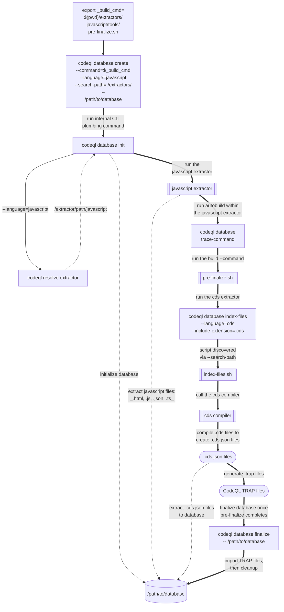

# codeql-sap-js:extractors/README.md

## CodeQL CDS Extractor : Flowchart

The following flowchart shows the flow of execution for the current implementation of the extractor.

```mermaid
flowchart TD
    COM["`export _build_cmd=<br>$(pwd)/extractors/
javascript/tools/
pre-finalize.sh`"]
    DCR[codeql database create<br>--command=$_build_cmd<br>--language=javascript<br>--search-path=./extractors/<br>--<br>/path/to/database]
    DB@{ shape: cyl, label: "/path/to/database" }
    DINIT[codeql database init]
    CRE[codeql resolve extractor]
    DTRAC[codeql database<br>trace-command]
    SPF[[pre-finalize.sh]]
    JSE[[javascript extractor]]
    SIF[[index-files.sh]]
    DIDX[codeql database index-files<br> --language=cds<br>--include-extension=.cds]
    CC[[cds compiler]]
    CDJ([.cds.json files])
    TF([CodeQL TRAP files])
    DBF[codeql database finalize<br> -- /path/to/database]

    COM ==> DCR
    DCR ==> |run internal CLI<br>plumbing command| DINIT
    DINIT ----> |--language=javascript| CRE
    CRE -..-> |/extractor/path/javascript| DINIT
    DINIT -.initialize database.-> DB

    DINIT ==> |run the<br>javascript extractor| JSE
    SPF ==> |run the cds extractor| DIDX
    JSE -.-> |extract javascript files:<br>_.html, .js, .json, .ts_| DB
    DTRAC ==> |run the build --command| SPF
    JSE ==> |run autobuild within<br>the javascript extractor| DTRAC
    DIDX ==> |script discovered<br>via --search-path| SIF
    SIF ==> |call the cds compiler| CC
    CC ==> |compile .cds files to<br>create .cds.json files| CDJ
    CDJ -.-> |extract .cds.json files<br>to database| DB

    CDJ ==> |generate .trap files| TF
    TF ==> |finalize database once<br>pre-finalize completes| DBF
    DBF ==> |import TRAP files,<br>then cleanup| DB
```
